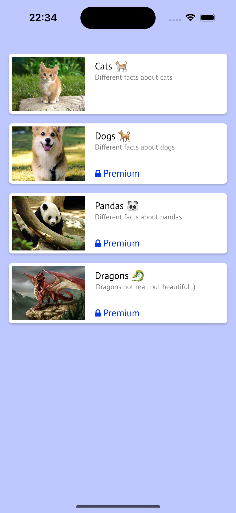
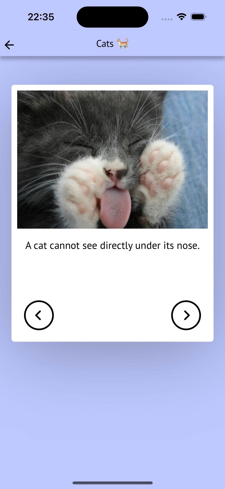

# Promova iOS test task

## Technical requirements met

- Swift
- [TCA](https://github.com/pointfreeco/swift-composable-architecture)
- SwiftUI
- async/await
- DI
- iOS 16+

## Additional features

- Support lanscape mode
- Empty state for Facts screen

## Screenshots

Here is an example how application might look like, but the final decision is up to you.

|Categories screen|Facts screen|
| --- | --- |
|||

## Demo video
[Demo](https://drive.google.com/file/d/1D3jdUO3xgEIhtmynuYeyodw1YJbXt5Z8/view?usp=sharing)
